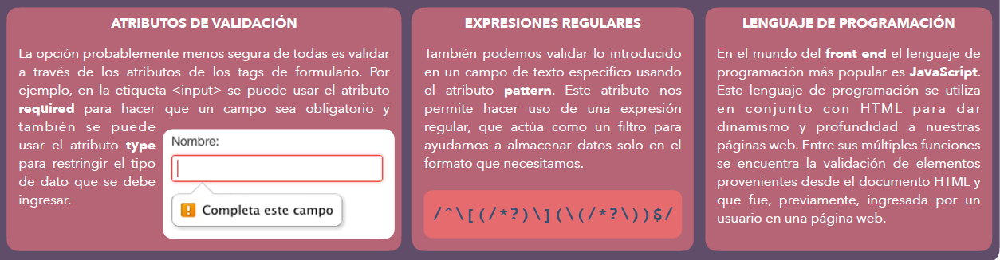

# Módulo II - Sesión II

## Agenda

- Formularios

## Formularios

La principal estructura de los formularios HTML es la etiqueta `<form>`, anidadas en la misma se encuentran los demás elementos, en específico, las etiquetas `<input>` y `<label>`.

**Input:** la etiqueta `<input>` posee muchas posibles opciones para su atributo `type`, dentro de los más comunes podemos encontrar;

- `text`
- `file`
- `number`
- `password`
- `email`

## Formularios HTML

### ¿Qué es un formulario web?

Un formulario web es un conjunto de “cajas de texto”. Son los principales puntos de interacción entre un usuario y un sitio web o aplicación, permitiendo que el usuario ingrese datos que generalmente serán enviados al servidor web para su procesamiento y almacenamiento.

### Controles de formulario

Los formularios, como dijimos previamente, están compuestos por uno o más controles de formulario (widgets). Estos controles pueden ser campos de texto, cajas desplegables, botones, casillas de verificaciones o botones de opción y se crean principalmente con la etiqueta `<input>`. Estos controles de formularios pueden ser programados para forzar la introducción de formatos o valores específicos. Esta acción se realiza porque es fundamental validar el correcto ingreso de datos, ya que esta información es muy importante.

### Elemento FORM

Dentro de las etiquetas `<form></form>` se encerrarán todos los elementos que componen un formulario, como los tags `<input>`, `<label>` y `<button>`. Además, esta etiqueta cuenta con atributos básicos como action, que define qué “acción” se realizará con la información enviada por el formulario y method ,que define el método HTTP por el cual se enviarán los datos (GET o POST).

```html
<form>
  <label for=""></label>
  <input type="text" name="" id="" />
</form>
```

### Validación de formularios

Existen 3 formas de realizar validaciones a los datos que el usuario ingresa en un formulario para concluir si es correcto y puede ser enviado a un servidor para ser almacenado o no.

